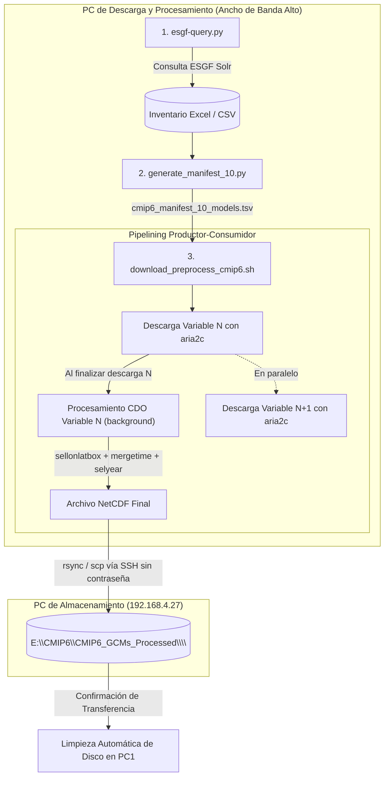

# Pipeline de Disponibilidad, Descarga y Preprocesamiento de Modelos CMIP6 (Centroamérica / DeepSD)

Este repositorio contiene las herramientas automatizadas para:
1. **Consultar la disponibilidad** de modelos climáticos globales CMIP6 en el índice distribuido de **ESGF MetaGrid** mediante la API Solr.
2. **Cruzar la disponibilidad** con el catálogo de modelos evaluados en **GCMEval**.
3. **Extraer URLs HTTPS directas** a nivel de archivo NetCDF (`type=File`), resolviendo réplicas y priorizando nodos de alta velocidad con soporte **Globus** (`*.data.globus.org`).
4. **Ejecutar un pipeline automatizado de descarga y preprocesamiento con CDO**:
   - **Arquitectura Pipelined (Asíncrona)**: Descarga de la variable $N+1$ con `aria2c` en simultáneo con el procesamiento CDO de la variable $N$.
   - **Transferencia Remota Automática por SSH/rsync**: Envío directo de archivos procesados a una PC de almacenamiento (`192.168.4.27:E:\CMIP6\CMIP6_GCMs_Processed\<MODELO>\`) preservando la jerarquía de directorios.
   - **Optimización de Espacio en Disco**: Eliminación inmediata de archivos temporales y locales tras confirmar la transferencia remota.
   - **Reanudación Automática (Resume)**: Detección inteligente de archivos ya procesados en destino local o remoto.
   - **Ejecución Persistente en Segundo Plano**: Soporte para servidores remotos y WSL2 sin interrupciones por cierre de sesión.

---

## 📋 Tabla de Contenidos

- [Estructura del Repositorio](#-estructura-del-repositorio)
- [Requisitos y Dependencias](#-requisitos-y-dependencias)
- [Modelos, Variables y Experimentos](#-modelos-variables-y-experimentos)
- [Flujo de Trabajo Paso a Paso](#-flujo-de-trabajo-paso-a-paso)
  - [Paso 1: Inventario Global y Extracción de URLs (`esgf-query.py`)](#paso-1-inventario-global-y-extracción-de-urls-esgf-querypy)
  - [Paso 2: Generación del Manifiesto de 10 Modelos (`generate_manifest_10.py`)](#paso-2-generación-del-manifiesto-de-10-modelos-generate_manifest_10py)
  - [Paso 3: Descarga, Preprocesamiento y Transferencia Remota (`download_preprocess_cmip6.sh`)](#paso-3-descarga-preprocesamiento-y-transferencia-remota-download_preprocess_cmip6sh)
- [Configuración de Transferencia Remota (SSH sin contraseña)](#-configuración-de-transferencia-remota-ssh-sin-contraseña)
- [Ejecución en Servidores Remotos y Segundo Plano](#-ejecución-en-servidores-remotos-y-segundo-plano)
- [Ejecución en Windows con WSL2](#-ejecución-en-windows-con-wsl2-sin-que-se-corte-al-cerrar-la-ventana)
- [Estructura de Salida](#-estructura-de-salida)
- [Detalles Técnicos y Optimización](#-detalles-técnicos-y-optimización)
- [Autor](#-autor)

---

## 📂 Estructura del Repositorio

```text
.
├── esgf-query.py                  # Script principal: consulta ESGF Solr, genera inventario y extrae URLs
├── generate_manifest_10.py        # Generador del manifiesto para los 10 modelos seleccionados (100% completos)
├── download_preprocess_cmip6.sh   # Pipeline en Bash: descarga aria2c + CDO pipelined + rsync/scp remoto
├── run_background.sh              # Gestor de ejecución en segundo plano (start, status, log, stop)
├── gcmeval_models.csv             # Catálogo de modelos compatibles con GCMEval
├── gcmeval_ensemble_models.csv    # Catálogo de miembros de ensamble GCMEval
│
├── cmip6_daily_inventory.xlsx     # Libro Excel (hojas: inventory, summary, selected, files)
├── cmip6_daily_inventory.csv      # Inventario tabular de datasets
├── cmip6_files.csv                # Catálogo completo de archivos NetCDF extraídos
│
├── cmip6_manifest_10_models.tsv   # Manifiesto TSV para automatización de los 10 modelos (8,667 archivos)
├── cmip6_files_10_models.csv      # Catálogo CSV de los 10 modelos
├── cmip6_urls_10_models.txt       # Lista plana de URLs directas para descarga
└── README.md                      # Documentación completa del flujo de trabajo
```

---

## ⚙️ Requisitos y Dependencias

### 1. Entorno Python y Herramientas CLI (Recomendado vía Mamba / Conda)

Se recomienda utilizar **Mamba** (o **Conda**) por su rapidez en la resolución de paquetes de clima (`cdo`, `aria2`, `openpyxl`).

#### Opción A: Usando Mamba (Recomendado)

```bash
# 1. Crear y activar el entorno con todas las dependencias
mamba create -n climate python=3.11 requests pandas openpyxl urllib3 cdo aria2 curl rsync openssh coreutils -c conda-forge -y
mamba activate climate
```

#### Opción B: Usando Conda

```bash
# 1. Crear y activar entorno
conda create -n climate python=3.11 -y
conda activate climate

# 2. Instalar paquetes de Python y herramientas CLI
conda install -c conda-forge requests pandas openpyxl urllib3 cdo aria2 curl rsync openssh coreutils -y
```

### 2. Herramientas del Sistema (CLI Linux)

El pipeline automatizado utiliza:
- **`cdo`** (Climate Data Operators con soporte multi-hilo OpenMP)
- **`aria2c`** (Gestor de descargas aceleradas multi-conexión y validación de hash)
- **`rsync`** o **`scp`** + **`ssh`** (Transferencia de archivos remota)
- **`sha256sum`** o **`shasum`** (Verificación de integridad de archivos NetCDF)
- **`curl`**, **`awk`**, **`coreutils`**

**Instalación nativa en Ubuntu / Debian Linux:**
```bash
sudo apt-get update && sudo apt-get install -y cdo aria2 curl rsync openssh-client coreutils
```

**Instalación nativa en RedHat / CentOS / Rocky Linux:**
```bash
sudo dnf install -y epel-release && sudo dnf install -y cdo aria2 curl rsync openssh-clients coreutils
```

---

## 🌍 Modelos, Variables y Experimentos

### 10 Modelos de Ensamble Seleccionados (Evaluación de Cobertura Temporal en ESGF)

El catálogo evalúa la disponibilidad de los 10 modelos aplicando un **filtrado estricto por período de interés** (`1950-2014` para historical y `2015-2100` para SSPs):

| N° | Modelo (`source_id`) | Miembro (`variant_label`) | Datasets en Período | Estado |
|:---|:---------------------|:--------------------------|:-------------------:|:------:|
| 1 | `NorESM2-MM` | `r1i1p1f1` | 50 / 50 | 100% Completo (1950-2014 / 2015-2100) |
| 2 | `EC-Earth3` | `r4i1p1f1` | 50 / 50 | 100% Completo (1950-2014 / 2015-2100) |
| 3 | `UKESM1-0-LL` | `r1i1p1f2` | 50 / 50 | 100% Completo (1950-2014 / 2015-2100) |
| 4 | `MPI-ESM1-2-LR` | `r5i1p1f1` | 50 / 50 | 100% Completo (1950-2014 / 2015-2100) |
| 5 | `TaiESM1` | `r1i1p1f1` | 50 / 50 | 100% Completo (1950-2014 / 2015-2100) |
| 6 | `MRI-ESM2-0` | `r1i1p1f1` | 50 / 50 | 100% Completo (1950-2014 / 2015-2100) |
| 7 | `IPSL-CM6A-LR` | `r2i1p1f1` | 50 / 50 | 100% Completo (1950-2014 / 2015-2100) |
| 8 | `INM-CM4-8` | `r1i1p1f1` | 50 / 50 | 100% Completo (1950-2014 / 2015-2100) |
| 9 | `KACE-1-0-G` | `r1i1p1f1` | 50 / 50 | 100% Completo (1950-2014 / 2015-2100) |
| 10 | `ACCESS-CM2` | `r1i1p1f1` | 46 / 50 | 46 completos (4 variables con extensiones no deseadas en ESGF) |

### 10 Variables Diarias (`table_id = day`)
- `ua`: Viento zonal (m/s)
- `va`: Viento meridional (m/s)
- `ta`: Temperatura del aire (K)
- `hur`: Humedad relativa (%)
- `hus`: Humedad específica (1)
- `zg`: Altura geopotencial (m)
- `psl`: Presión reducida a nivel del mar (Pa)
- `tasmax`: Temperatura máxima diaria del aire en superficie (K)
- `tasmin`: Temperatura mínima diaria del aire en superficie (K)
- `pr`: Precipitación diaria (kg m-2 s-1)

### 5 Experimentos y Períodos de Interés Configurables
- `historical`: `1950-2014` (Configurable en scripts vía `PERIOD_RANGES` o `HISTORICAL_START_YEAR` / `HISTORICAL_END_YEAR`)
- `ssp126`, `ssp245`, `ssp370`, `ssp585`: `2015-2100` (Configurable vía `SSP_START_YEAR` / `SSP_END_YEAR`)

---

## 🚀 Flujo de Trabajo Paso a Paso



---

### Paso 1: Inventario Global y Extracción de URLs (`esgf-query.py`)

Este script realiza la búsqueda en el índice de MetaGrid (`https://metagrid.esgf-west.org/proxy/search`):
- **Fase 1**: Evalúa la disponibilidad a nivel de dataset para las 10 variables y 5 experimentos, consolida el resumen por modelo y realiza el cruce con `gcmeval_models.csv`.
- **Fase 2**: Para los modelos seleccionados, consulta a nivel de archivo (`type=File`), resuelve réplicas priorizando URLs Globus HTTPS (`*.data.globus.org`) y extrae los enlaces directos y hashes SHA256.

**Ejecución:**
```bash
python esgf-query.py
```

**Salidas generadas:**
- `cmip6_daily_inventory.xlsx`: Libro Excel con 4 hojas formateadas condicionalmente:
  - `inventory`: Matriz de disponibilidad por experimento.
  - `summary`: Resumen consolidado ordenado por cobertura.
  - `selected`: Modelos completos con enlaces de búsqueda MetaGrid.
  - `files`: Catálogo de archivos NetCDF con enlaces directos clicables "Abrir".
- `cmip6_daily_inventory.csv`: Inventario general tabular.
- `cmip6_files.csv`: Catálogo plano de archivos NetCDF.

---

### Paso 2: Generación del Manifiesto de 10 Modelos (`generate_manifest_10.py`)

Genera el catálogo y manifiesto estructurado para los 10 modelos que tienen el 100% de disponibilidad:

**Ejecución:**
```bash
python generate_manifest_10.py
```

**Salidas generadas:**
- `cmip6_manifest_10_models.tsv`: Manifiesto delimitado por tabuladores (TSV) con URLs, checksums SHA256, tamaños de archivo y metadatos.
- `cmip6_files_10_models.csv`: Catálogo CSV de los 10 modelos (8,667 archivos).
- `cmip6_urls_10_models.txt`: Lista plana de URLs directas.

---

### Paso 3: Descarga, Preprocesamiento y Transferencia Remota (`download_preprocess_cmip6.sh`)

El shell script ejecuta el pipeline de alto rendimiento:

1. **Reanudación Inteligente (Resume)**: Verifica si el archivo procesado ya existe en la máquina remota (o local) antes de descargar.
2. **Descarga Acelerada (`aria2c`)**: Descarga los segmentos temporales de la variable actual con validación SHA256.
3. **Pipelining Asíncrono**:
   - Lanza el procesamiento CDO de la variable descargada en segundo plano (`process_variable_worker &`).
   - Inicia inmediatamente la descarga con `aria2c` de la siguiente variable, eliminando tiempos muertos de red.
4. **Recorte Espacial con CDO**: Aplica `sellonlatbox,-120,-40.5,-18.5,43` (Centroamérica ampliada) a cada chunk con multi-hilo OpenMP (`CDO_THREADS=$(nproc)`).
5. **Concatenación y Selección Temporal**: Une los chunks con `mergetime` y filtra los años según el experimento:
   - `historical`: `1950/2014`
   - Escenarios SSP (`ssp126`, `ssp245`, `ssp370`, `ssp585`): `2015/2100`
6. **Transferencia Remota Automática**: Envía el archivo resultante vía `rsync` (o `scp`) a `192.168.4.27:E:/CMIP6/CMIP6_GCMs_Processed/<MODELO>/`.
7. **Limpieza Inmediata de Disco**: Tras confirmar la transferencia, elimina los archivos brutos y procesados locales, manteniendo la PC de descarga siempre con espacio libre.

**Ejecución estándar:**
```bash
# Dar permisos de ejecución
chmod +x download_preprocess_cmip6.sh

# Ejecutar pipeline
./download_preprocess_cmip6.sh
```

**Personalización de variables de entorno:**
```bash
# Ejemplo: cambiar host remoto, hilos de CDO o ancho de banda
REMOTE_HOST="192.168.4.27" \
REMOTE_DEST_DIR="E:/CMIP6/CMIP6_GCMs_Processed" \
CDO_THREADS=16 \
MAX_DOWNLOAD_LIMIT=0 \
./download_preprocess_cmip6.sh
```

---

## 🔑 Configuración de Transferencia Remota (SSH sin contraseña)

Para que el script pueda transferir automáticamente los archivos a la PC de almacenamiento (`192.168.4.27`) con el usuario de dominio `AMBIENTE\wabarca` sin pedir contraseña en cada variable:

1. **Configurar el cliente SSH en la PC de descarga (`~/.ssh/config`):**
   Agrega las siguientes líneas a tu archivo `~/.ssh/config`:
   ```text
   Host 192.168.4.27
       User AMBIENTE\wabarca
       Port 22
   ```

2. **Generar clave SSH en la PC de descarga (si no existe):**
   ```bash
   ssh-keygen -t ed25519 -N "" -f ~/.ssh/id_ed25519
   ```

3. **Copiar la clave pública a la PC de almacenamiento Windows:**
   - La clave pública (`~/.ssh/id_ed25519.pub`) debe agregarse al archivo:
     - Si el usuario `wabarca` es usuario estándar: `C:\Users\wabarca\.ssh\authorized_keys`
     - Si el usuario `wabarca` pertenece al grupo Administradores: `C:\ProgramData\ssh\administrators_authorized_keys` (con permisos de lectura exclusivos para SYSTEM y Administrators).

4. **Verificar la conexión:**
   ```bash
   ssh "AMBIENTE\wabarca@192.168.4.27" "echo Conexión exitosa"
   ```

---

## 🖥️ Ejecución en Servidores Remotos y Segundo Plano

Cuando se ejecuta el proceso en un servidor remoto a través de SSH, es fundamental evitar que el proceso se detenga si la sesión se desconecta:

### Opción 1: Helper Automatizado `run_background.sh` (Recomendado)

```bash
# Dar permisos de ejecución
chmod +x run_background.sh

# 1. Iniciar el pipeline en segundo plano
./run_background.sh start

# 2. Consultar el estado del proceso
./run_background.sh status

# 3. Monitorear los logs en tiempo real (Ctrl + C para salir sin detener el proceso)
./run_background.sh log

# 4. Detener el proceso si es necesario
./run_background.sh stop
```

---

### Opción 2: Usando `tmux` (Sesión Interactiva Persistente)

```bash
# 1. Crear e ingresar a una nueva sesión de tmux
tmux new -s cmip6_job

# 2. Iniciar el script
./download_preprocess_cmip6.sh

# 3. Desconectar la sesión sin detener el proceso (Detach):
#    Presiona Ctrl + b, luego suelta y presiona d

# 4. (Seguro desconectar SSH) Para volver a ver el proceso:
tmux attach -t cmip6_job
```

---

### Opción 3: Usando `screen`

```bash
# Iniciar sesión screen
screen -S cmip6_job
./download_preprocess_cmip6.sh

# Desconectar: Presiona Ctrl + a, luego d
# Reconectar:
screen -r cmip6_job
```

---

## 🪟 Ejecución en Windows con WSL2 (Sin que se corte al cerrar la ventana)

En **WSL2**, si se cierra la ventana de la terminal, Windows puede suspender la máquina virtual si no está configurada adecuadamente. Para evitar que el proceso se corte:

### 1. Activar `systemd` en WSL2 (Windows 11)

1. Edita el archivo `/etc/wsl.conf` dentro de WSL2:
   ```bash
   sudo nano /etc/wsl.conf
   ```
2. Agrega:
   ```ini
   [boot]
   systemd=true
   ```
3. Reinicia WSL2 desde PowerShell de Windows:
   ```powershell
   wsl --shutdown
   ```

### 2. Lanzar en segundo plano desde PowerShell de Windows

Puedes lanzar el proceso directamente desde Windows sin mantener ninguna ventana de WSL abierta:

```powershell
# Iniciar en segundo plano:
wsl -d Ubuntu --exec bash -c "cd /ruta/de/tu/proyecto && ./run_background.sh start"

# Consultar el estado en cualquier momento:
wsl -d Ubuntu --exec bash -c "cd /ruta/de/tu/proyecto && ./run_background.sh status"
```

---

## 📁 Estructura de Salida

En la PC de almacenamiento (`192.168.4.27` en `E:\CMIP6\CMIP6_GCMs_Processed\`), los archivos procesados se organizan en subcarpetas por cada modelo:

```text
E:\CMIP6\CMIP6_GCMs_Processed\
├── ACCESS-CM2\
│   ├── hur_day_ACCESS-CM2_historical_r1i1p1f1_19500101-20141231.nc
│   ├── hur_day_ACCESS-CM2_ssp126_r1i1p1f1_20150101-21001231.nc
│   ├── pr_day_ACCESS-CM2_historical_r1i1p1f1_19500101-20141231.nc
│   ├── psl_day_ACCESS-CM2_historical_r1i1p1f1_19500101-20141231.nc
│   ├── ta_day_ACCESS-CM2_historical_r1i1p1f1_19500101-20141231.nc
│   ├── tasmax_day_ACCESS-CM2_historical_r1i1p1f1_19500101-20141231.nc
│   ├── tasmin_day_ACCESS-CM2_historical_r1i1p1f1_19500101-20141231.nc
│   ├── ua_day_ACCESS-CM2_historical_r1i1p1f1_19500101-20141231.nc
│   ├── va_day_ACCESS-CM2_historical_r1i1p1f1_19500101-20141231.nc
│   └── zg_day_ACCESS-CM2_historical_r1i1p1f1_19500101-20141231.nc
├── EC-Earth3\
├── INM-CM4-8\
├── IPSL-CM6A-LR\
├── KACE-1-0-G\
├── MPI-ESM1-2-LR\
├── MRI-ESM2-0\
├── NorESM2-MM\
├── TaiESM1\
└── UKESM1-0-LL\
```

---

## 💡 Detalles Técnicos y Optimización

### 1. Nodos Globus y URLs HTTPS
En ESGF, los nodos integrados con la infraestructura de Globus (como **Argonne ALCF** `eagle.alcf.anl.gov` y **LLNL**) exponen el servicio `HTTPServer` a través de URLs directas en el dominio `https://*.data.globus.org/`. El script prioriza automáticamente estas URLs por ofrecer altas tasas de transferencia y disponibilidad directa vía HTTPS estándar (código HTTP 200).

### 2. Deduplicación Inteligente de Réplicas
Cuando un archivo existe replicado en varios nodos (`data_node`), el algoritmo clasifica y selecciona la mejor réplica:
1. **Prioridad 1 (Máxima)**: URLs HTTPS de Globus (`*.data.globus.org` o nodos con soporte Globus).
2. **Prioridad 2**: URLs HTTPS seguras de THREDDS (`https://.../thredds/fileServer/...`).
3. **Prioridad 3**: URLs HTTP estándar de THREDDS (`http://.../thredds/fileServer/...`).

### 3. Pipelining Asíncrono de Procesamiento
Para maximizar la utilización del ancho de banda y la capacidad de cómputo:
- El cuello de botella de red y de CPU se desacoplan.
- Mientras `cdo` procesa los archivos de la variable $N$, `aria2c` descarga los de la variable $N+1$.
- Al concluir el procesamiento y la transferencia remota, los archivos locales se eliminan inmediatamente, manteniendo el uso de disco acotado a solo 1 o 2 variables concurrentes.

---

## 👤 Autor

- **Will Abarca** (`wabarca@ambiente.gob.sv`)
- Ministerio de Medio Ambiente y Recursos Naturales (MARN), El Salvador.
