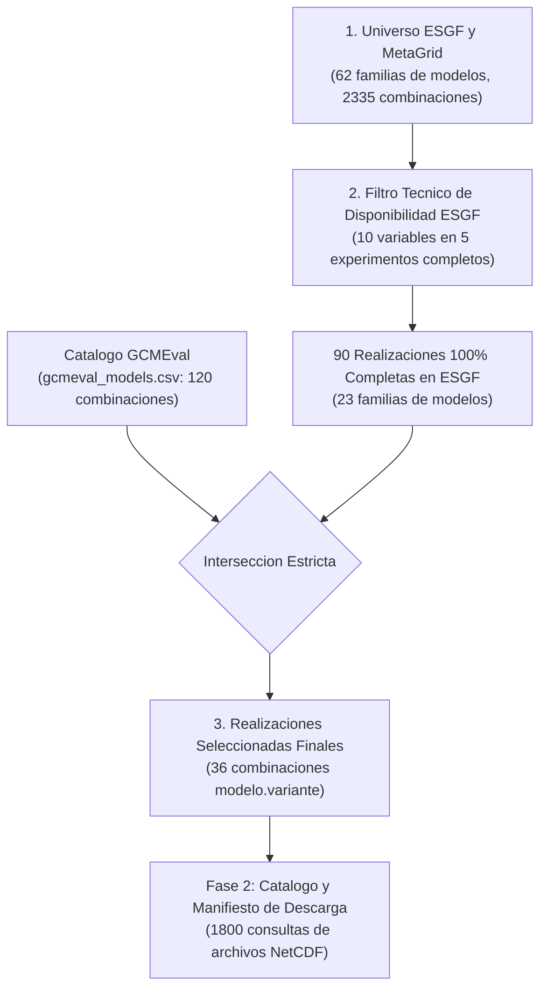
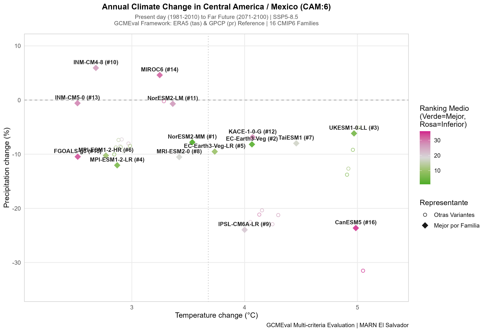
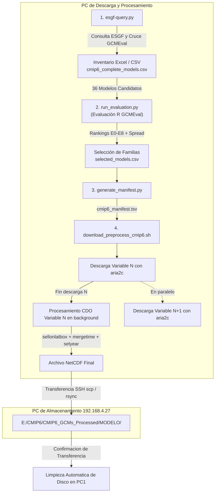

# Cadena Automatizada de Disponibilidad, Descarga y Preprocesamiento de Modelos CMIP6 (Centroamérica / DeepSD)

Este repositorio contiene las herramientas automatizadas para:
1. **Consultar la disponibilidad** de modelos climáticos globales CMIP6 en el índice distribuido de **ESGF MetaGrid** mediante la API Solr.
2. **Cruzar la disponibilidad** con el catálogo de modelos evaluados en **GCMEval**.
3. **Extraer URLs HTTPS directas** a nivel de archivo NetCDF (`type=File`), resolviendo réplicas y priorizando nodos de alta velocidad con soporte **Globus** (`*.data.globus.org`).
4. **Ejecutar un flujo automatizado de descarga y preprocesamiento con CDO**:
   - **Ejecución Concurrente Asíncrona (Productor-Consumidor)**: Descarga de la variable $N+1$ con `aria2c` en simultáneo con el procesamiento CDO de la variable $N$.
   - **Transferencia Remota Automática por SSH/rsync**: Envío directo de archivos procesados a una PC de almacenamiento (`192.168.4.27:E:\CMIP6\CMIP6_GCMs_Processed\<MODELO>\`) preservando la jerarquía de directorios.
   - **Optimización de Espacio en Disco**: Eliminación inmediata de archivos temporales y locales tras confirmar la transferencia remota.
   - **Reanudación Automática (Resume)**: Detección inteligente de archivos ya procesados en destino local o remoto.
   - **Ejecución Persistente en Segundo Plano**: Soporte para servidores remotos y WSL2 sin interrupciones por cierre de sesión.

---

## 📋 Tabla de Contenidos

- [Estructura del Repositorio](#-estructura-del-repositorio)
- [Requisitos y Dependencias](#-requisitos-y-dependencias)
- [Modelos, Variables y Experimentos](#-modelos-variables-y-experimentos)
- [Evaluación Climatológica y Selección de Ensamble (GCMEval Centroamérica CAM:6)](#-evaluación-climatológica-y-selección-de-ensamble-gcmeval-centroamérica-cam6)
  - [Embudo de Selección de Realizaciones y Familias](#embudo-de-selección-de-realizaciones-y-familias)
  - [Diseño y Justificación Climatológica de los 9 Experimentos (E0 a E8)](#diseño-y-justificación-climatológica-de-los-9-experimentos-e0-a-e8)
  - [Metodología de Selección en 3 Etapas y Ranking Final de Familias](#metodología-de-selección-en-3-etapas-y-ranking-final-de-familias)
  - [Espacio de Incertidumbre y Gráfico de Dispersión Futuro (ΔT vs ΔP)](#espacio-de-incertidumbre-y-gráfico-de-dispersión-futuro-δt-vs-δp)
  - [Anexo Técnico: Cálculo de Estadísticas GCMEval para Nuevos Modelos (CDO + R)](#anexo-técnico-cálculo-de-estadísticas-gcmeval-para-nuevos-modelos-cdo--r)
- [Flujo de Trabajo Paso a Paso](#-flujo-de-trabajo-paso-a-paso)
  - [Paso 1: Inventario Global y Extracción de URLs (`esgf-query.py`)](#paso-1-inventario-global-y-extracción-de-urls-esgf-querypy)
  - [Paso 2: Generación Dinámica del Manifiesto (`generate_manifest.py`)](#paso-2-generación-dinámica-del-manifiesto-generate_manifestpy)
  - [Paso 3: Descarga, Preprocesamiento y Transferencia Remota (`download_preprocess_cmip6.sh`)](#paso-3-descarga-preprocesamiento-y-transferencia-remota-download_preprocess_cmip6sh)
- [Configuración de Transferencia Remota (SSH sin contraseña)](#-configuración-de-transferencia-remota-ssh-sin-contraseña)
- [Ejecución en Servidores Remotos y Segundo Plano](#-ejecución-en-servidores-remotos-y-segundo-plano)
- [Ejecución en Windows con WSL2](#-ejecución-en-windows-con-wsl2-sin-que-se-corte-al-cerrar-la-ventana)
- [Estructura de Salida](#-estructura-de-salida)
- [Detalles Técnicos y Optimización](#-detalles-técnicos-y-optimización)
- [Autor](#-autor)

---

## 📂 Estructura del Repositorio

```text
.
├── esgf-query.py                  # Script principal: consulta ESGF Solr, genera inventario y extrae URLs
├── generate_manifest.py           # Generador dinámico de manifiestos a partir de un archivo CSV de modelos
├── selected_models.csv            # Lista de modelos seleccionados para generar manifiestos (formato NOMBRE.variante)
├── download_preprocess_cmip6.sh   # Script Bash: descarga aria2c + procesamiento CDO concurrente + rsync/scp remoto
├── run_background.sh              # Gestor de ejecución en segundo plano (start, status, log, stop)
├── gcmeval/                       # Módulo analítico y motor de evaluación de GCMEval
│   ├── run_cmip6_evaluation.R     # Script R principal: ejecuta 9 experimentos, ranking 3 etapas y spread
│   ├── gcmeval_models.csv         # Catálogo de 120 modelos evaluables en GCMEval
│   ├── back-end/                  # Paquete R gcmeval, funciones estadísticas y datos (statistics.rda)
│   └── front-end/                 # Aplicación web interactiva Shiny
│
├── results/                       # Salidas de evaluación y rankings generados
│   ├── ranking_E0.csv ... E8.csv  # Rankings individuales por cada experimento
│   ├── ranking_summary_all_experiments.csv # Matriz consolidada de los 9 experimentos
│   ├── analysis_stage1_variants.csv        # Etapa 1: Estadísticas de las 36 variantes
│   ├── analysis_stage2_best_variants.csv   # Etapa 2: Mejor variante seleccionada por familia
│   ├── analysis_stage3_families.csv        # Etapa 3: Ranking final de las 16 familias
│   ├── future_spread_data.csv              # Datos de cambio climático proyectado (ΔT y ΔP)
│   ├── future_spread_ssp585_CAM.png        # Gráfico estático de alta resolución (300 DPI)
│   └── future_spread_ssp585_CAM.html       # Gráfico interactivo Web / Plotly (estilo Shiny)
│
├── generate_report_docx.py        # Generador del informe técnico profesional en formato Microsoft Word
├── Informe_Evaluacion_Seleccion_Modelos_CMIP6_Centroamerica.docx # Informe técnico completo del proyecto
│
├── cmip6_daily_inventory.xlsx     # Libro Excel (hojas: inventory, summary, selected, files) con columnas de período
├── cmip6_daily_inventory.csv      # Inventario tabular de datasets
├── cmip6_complete_models.csv      # Listado de modelos con 100% de disponibilidad (sin encabezado, NOMBRE.variante)
├── cmip6_files.csv                # Catálogo completo de archivos NetCDF extraídos
│
├── cmip6_manifest.tsv             # Manifiesto TSV para automatización de descarga y CDO
├── cmip6_urls.txt                 # Lista plana de URLs directas para descarga
└── README.md                      # Documentación completa del flujo de trabajo
```

---

## ⚙️ Requisitos y Dependencias

El pipeline integra herramientas en **Python** (consultas ESGF, manifiestos, reportes), **R** (evaluación y ranking estadístico GCMEval) y **herramientas CLI del sistema** (CDO, aria2c, SSH).

### 1. Entorno Python (Recomendado vía Mamba / Conda)

Se recomienda utilizar **Mamba** (o **Conda**) en un entorno Python 3.11:

```bash
# 1. Crear y activar el entorno con todas las dependencias
mamba create -n climate python=3.11 requests pandas openpyxl python-docx urllib3 cdo aria2 curl rsync openssh coreutils -c conda-forge -y
mamba activate climate
```

### 2. Entorno R (Versión 4.4+) y Librerías de GCMEval

Para ejecutar el módulo de evaluación [`gcmeval/run_cmip6_evaluation.R`](file:///c:/Users/wabarca/OneDrive/Workspace/climate/escenarios-centroamerica/fase_3/deepsd-downscaling/model-evaluation/gcmeval/run_cmip6_evaluation.R) y generar los gráficos interactivos:

- **R Base**: R >= 4.4.0 instalado (`Rscript`).
- **Paquetes de R necesarios**:
  ```R
  install.packages(c("shiny", "shinydashboard", "shinyjs", "DT", "plotrix", "fields", "sf", "plotly", "htmlwidgets", "ggplot2", "devtools"))
  
  # Instalar el paquete gcmeval local:
  devtools::install("gcmeval/back-end")
  ```

### 3. Herramientas del Sistema (CLI Linux)

El pipeline automatizado de descarga y recorte utiliza:
- **`cdo`** (Climate Data Operators con soporte multi-hilo OpenMP)
- **`aria2c`** (Gestor de descargas aceleradas multi-conexión y validación de hash)
- **`rsync`** o **`scp`** + **`ssh`** (Transferencia remota de archivos procesados)
- **`sha256sum`** o **`shasum`** (Verificación de integridad)

**Instalación nativa en Linux:**
```bash
# Ubuntu / Debian:
sudo apt-get update && sudo apt-get install -y cdo aria2 curl rsync openssh-client coreutils

# RedHat / CentOS / Rocky:
sudo dnf install -y epel-release && sudo dnf install -y cdo aria2 curl rsync openssh-clients coreutils
```

---

## 🌍 Modelos, Variables y Experimentos

### Embudo de Selección y Filtrado Metodológico (ESGF → Período → GCMEval)

El inventario aplica un embudo jerárquico de 3 niveles para garantizar que únicamente se descarguen y procesen realizaciones válidas tanto a nivel técnico en la infraestructura de datos de ESGF como a nivel metodológico en el marco de evaluación de GCMEval:



1. **Nivel 1: Familias de Modelos y Realizaciones en ESGF:**
   * Detecta todas las familias de modelos (`source_id`) y corridas/miembros (`variant_label`) publicadas en los nodos federados de ESGF para la frecuencia diaria (`table_id=day`).
2. **Nivel 2: Criterio de Disponibilidad Técnica y Cobertura Temporal:**
   * Filtra las realizaciones que poseen publicadas **las 10 variables diarias en los 5 experimentos requeridos** (`historical` y los 4 SSPs), garantizando que cubran el **100% de los años requeridos** (`1950/1980-2014` para historical y `2015-2100` para SSPs).
3. **Nivel 3: Subconjunto Validado en GCMEval:**
   * Cruza la lista resultante contra el catálogo objetivo de **GCMEval** ([`gcmeval/gcmeval_models.csv`](file:///c:/Users/wabarca/OneDrive/Workspace/climate/escenarios-centroamerica/fase_3/deepsd-downscaling/model-evaluation/gcmeval/gcmeval_models.csv)), seleccionando exactamente el subconjunto de **36 realizaciones** que cuentan con evaluación climática y respaldo metodológico.

---

### 10 Modelos de Ensamble Seleccionados (Evaluación de Cobertura Temporal en ESGF)

El catálogo evalúa la disponibilidad de los modelos aplicando un **filtrado estricto por período de interés** (`1950-2014` para historical y `2015-2100` para SSPs). La lista de modelos a procesar se gestiona en `selected_models.csv`:

| N° | Modelo (`source_id`) | Miembro (`variant_label`) | Datasets en Período | Estado |
|:---|:---------------------|:--------------------------|:-------------------:|:------:|
| 1 | `NorESM2-MM` | `r1i1p1f1` | 50 / 50 | 100% Completo (1950-2014 / 2015-2100) |
| 2 | `EC-Earth3` | `r4i1p1f1` | 50 / 50 | 100% Completo (1950-2014 / 2015-2100) |
| 3 | `UKESM1-0-LL` | `r1i1p1f2` | 50 / 50 | 100% Completo (1950-2014 / 2015-2100) |
| 4 | `MPI-ESM1-2-LR` | `r5i1p1f1` | 50 / 50 | 100% Completo (1950-2014 / 2015-2100) |
| 5 | `TaiESM1` | `r1i1p1f1` | 50 / 50 | 100% Completo (1950-2014 / 2015-2100) |
| 6 | `MRI-ESM2-0` | `r1i1p1f1` | 50 / 50 | 100% Completo (1950-2014 / 2015-2100) |
| 7 | `IPSL-CM6A-LR` | `r2i1p1f1` | 50 / 50 | 100% Completo (1950-2014 / 2015-2100) |
| 8 | `INM-CM4-8` | `r1i1p1f1` | 50 / 50 | 100% Completo (1950-2014 / 2015-2100) |
| 9 | `KACE-1-0-G` | `r1i1p1f1` | 50 / 50 | 100% Completo (1950-2014 / 2015-2100) |
| 10 | `ACCESS-CM2` | `r4i1p1f1` | 50 / 50 | 100% Completo (1950-2014 / 2015-2100) |

> **Nota**: Para `ACCESS-CM2`, la variante `r1i1p1f1` en ESGF carece de proyecciones 2015-2100 para algunas variables (publicó extensiones 2251-2300). Usando la variante `r4i1p1f1` (o `r5i1p1f1`), el ensamble alcanza el **100% de cobertura completa (50/50)**.

### 10 Variables Diarias (`table_id = day`)
- `ua`: Viento zonal (m/s)
- `va`: Viento meridional (m/s)
- `ta`: Temperatura del aire (K)
- `hur`: Humedad relativa (%)
- `hus`: Humedad específica (1)
- `zg`: Altura geopotencial (m)
- `psl`: Presión reducida a nivel del mar (Pa)
- `tasmax`: Temperatura máxima diaria del aire en superficie (K)
- `tasmin`: Temperatura mínima diaria del aire en superficie (K)
- `pr`: Precipitación diaria (kg m-2 s-1)

### 5 Experimentos y Períodos de Interés Configurables
- `historical`: `1950-2014` (Configurable en scripts vía `PERIOD_RANGES` o `HISTORICAL_START_YEAR` / `HISTORICAL_END_YEAR`)
- `ssp126`, `ssp245`, `ssp370`, `ssp585`: `2015-2100` (Configurable vía `SSP_START_YEAR` / `SSP_END_YEAR`)

---

## 📊 Evaluación Climatológica y Selección de Ensamble (GCMEval Centroamérica CAM:6)

Para garantizar la representatividad y robustez climática de los modelos globales (GCM) seleccionados para el downscaling estadístico (*DeepSD*) en América Central, se integró el motor analítico de **GCMEval** ([Brunner et al., 2020](https://doi.org/10.5194/esd-11-995-2020)).

La evaluación se realizó sobre la región IPCC **`"Central America/Mexico [CAM:6]"`**, utilizando datos observacionales de referencia globales de alta calidad:
- **Temperatura (`tas`)**: Reanálisis **ERA5** (ECMWF).
- **Precipitación (`pr`)**: Producto observacional satelital y de estaciones **GPCP v2.3** (Global Precipitation Climatology Project).

### Embudo de Selección de Realizaciones y Familias

De las **90 realizaciones** (23 familias) con disponibilidad técnica completa en ESGF (10 variables, 5 experimentos, 1950–2100), se identificaron **36 realizaciones** pertenecientes a **16 familias globales únicas** con métricas climatológicas precomputadas en GCMEval:

```text
36 Realizaciones Evaluadas en GCMEval (16 Familias Únicas):
├── NorESM2-MM (r1i1p1f1)
├── EC-Earth3-Veg (r4i1p1f1)
├── UKESM1-0-LL (r1i1p1f2, r2i1p1f2, r3i1p1f2, r4i1p1f2, r8i1p1f2)
├── MPI-ESM1-2-LR (r1i1p1f1, r2i1p1f1, r3i1p1f1, r4i1p1f1, r5i1p1f1, r6i1p1f1, r7i1p1f1, r8i1p1f1, r9i1p1f1, r10i1p1f1)
├── EC-Earth3-Veg-LR (r1i1p1f1)
├── MPI-ESM1-2-HR (r1i1p1f1)
├── TaiESM1 (r1i1p1f1)
├── MRI-ESM2-0 (r1i1p1f1)
├── IPSL-CM6A-LR (r1i1p1f1, r2i1p1f1, r3i1p1f1, r4i1p1f1, r6i1p1f1, r14i1p1f1)
├── INM-CM4-8 (r1i1p1f1)
├── NorESM2-LM (r1i1p1f1)
├── KACE-1-0-G (r1i1p1f1)
├── INM-CM5-0 (r1i1p1f1)
├── MIROC6 (r1i1p1f1, r2i1p1f1)
├── FGOALS-g3 (r1i1p1f1)
└── CanESM5 (r1i1p1f1, r2i1p1f1)
```

---

---

### Diseño y Justificación Climatológica de los 9 Experimentos (E0 a E8)

En el motor analítico y la interfaz de **GCMEval**, cada parámetro se calibra mediante pesos enteros discretos:
- **`0` = No considerado** (peso nulo).
- **`1` = Importante** (peso estándar de primer orden).
- **`2` = Muy importante** (máxima prioridad / peso doble).

#### 🎛️ Matriz de Pesos Asignados por Experimento en GCMEval

| Exp | Nombre del Experimento | $w_{tas}$ | $w_{pr}$ | $w_{ann}$ | $w_{djf}$ | $w_{mam}$ | $w_{jja}$ | $w_{son}$ | $w_{bias}$ | $w_{sd}$ | $w_{sc}$ | $w_{rmse}$ |
|:---:|:---|:---:|:---:|:---:|:---:|:---:|:---:|:---:|:---:|:---:|:---:|:---:|
| **E0** | **Control / Balance General** | 1 | 1 | 1 | 1 | 1 | 1 | 1 | 1 | 1 | 1 | 1 |
| **E1** | **Énfasis en Temperatura** | **2** | 1 | 1 | 1 | 1 | 1 | 1 | 1 | 1 | 1 | 1 |
| **E2** | **Énfasis en Precipitación** | 1 | **2** | 1 | 1 | 1 | 1 | 1 | 1 | 1 | 1 | 1 |
| **E3** | **Época Seca (Estiaje DJF+MAM)** | 1 | 1 | 1 | **2** | **2** | 0 | 0 | 1 | 1 | 1 | 1 |
| **E4** | **Época Lluviosa (MAM+JJA+SON)** | 1 | 1 | 1 | 0 | **2** | **2** | **2** | 1 | 1 | 1 | 1 |
| **E5** | **Temperatura en Época Seca** | **2** | 1 | 1 | **2** | **2** | 0 | 0 | 1 | 1 | 1 | 1 |
| **E6** | **Precipitación en Época Lluviosa** | 1 | **2** | 1 | 0 | **2** | **2** | **2** | 1 | 1 | 1 | 1 |
| **E7** | **Termodinámica Pura (Solo Temp)** | **2** | 0 | 1 | 1 | 1 | 1 | 1 | 1 | 1 | 1 | 1 |
| **E8** | **Hidrología Pura (Solo Lluvia)** | 0 | **2** | 1 | 1 | 1 | 1 | 1 | 1 | 1 | 1 | 1 |

#### 📚 Sustento Científico y Referencias Meteorológicas para Centroamérica

| Proceso Meteorológico Regional | Justificación Física y Relevancia en el Istmo | Referencias Científicas |
|:---|:---|:---|
| **Canícula / Veranillo (Mid-Summer Drought - MSD)** | Disminución de lluvias en julio-agosto dentro de la época lluviosa, modulada por la aceleración del Chorro del Caribe y divergencia de humedad. | *Magaña et al. (1999); Maldonado et al. (2016); Hidalgo et al. (2017)* |
| **Chorro de Bajo Nivel del Caribe (CLLJ)** | Flujo de vientos alisios que transporta humedad del Atlántico e interactúa con la cordillera generando contraste vertiente Caribe vs Pacífica. | *Amador (1998, 2008); Muñoz et al. (2008); Cook & Vizy (2010)* |
| **Teleconexiones ENOS / OAM** | Forzamiento del Pacífico ecuatorial que induce sequías severas en el Corredor Seco (El Niño) o excesos hídricos (La Niña). | *Enfield & Alfaro (1999); Alfaro (2007); Taylor et al. (2012)* |
| **Evaluación Multicriterio CMIP6** | Marco formal para ponderar modelos por desempeño y evitar sesgos por promedio simple o redundancia de código. | *Brunner et al. (2020); Parding et al. (2020); Almazroui et al. (2021)* |

---

### Criterios de Selección, Desduplicación y Remoción de Candidatos

Para definir el ensamble final se aplicaron tres criterios de exclusión:
1. **Desduplicación Intra-Familia (Condiciones Iniciales)**: Se evalúan todas las variantes (ej. 10 de MPI, 6 de IPSL, 5 de UKESM), pero se retiene únicamente el miembro con menor *Mean Rank* y mayor estabilidad.
2. **Discriminación por Resolución Espacial en la Misma Familia**:
   - **`NorESM2-MM` (~1°) vs `NorESM2-LM` (~2°)**: `NorESM2-MM` obtuvo el puesto **#1.00** unánime, mientras que `NorESM2-LM` cayó al puesto **#11** (Rank 26.67). Se descarta `LM` y se retiene únicamente `MM`.
   - **`EC-Earth3-Veg` (~100 km) vs `EC-Earth3-Veg-LR` (~250 km)**: `EC-Earth3-Veg` estándar superó ampliamente a la versión de baja resolución `LR` (Rank #2.22 vs #9.89). Se retiene la versión estándar `Veg`.
   - **`MPI-ESM1-2-LR` vs `MPI-ESM1-2-HR`**: La variante `MPI-ESM1-2-LR.r5i1p1f1` demostró mayor balance global (Rank #6.11) frente a `HR` (Rank #10.50).
3. **Exclusión por Sesgos Extremos o Sensibilidad No Física**:
   - **`CanESM5` (Rank #16 - 35.00)**: Rango inferior persistente (#35-#36), sensibilidad climática excesiva (ECS > 5.6°C) y secamiento extremo (-24% a -31%).
   - **`FGOALS-g3` (Rank #15)** y **`MIROC6` (Rank #14)**: Dificultades severas en capturar la dinámica orográfica centroamericana.
   - **`INM-CM4-8` (Rank #10)** e **`INM-CM5-0` (Rank #13)**: Muy baja sensibilidad térmica (+2.5°C) y señal anómala de incremento de precipitación (+5.9%), contraria al consenso físico.

---

### Metodología de Selección en 3 Etapas y Ranking Final de Familias

Para estructurar un ensamble multi-modelo robusto e independiente (evitando la sobre-representación de centros climáticos que publicaron decenas de variantes del mismo código fuente), se aplicó el siguiente protocolo:

1. **Etapa 1 (Estadística de Realizaciones)**: Cálculo de posición media (*Mean Rank*), desviación estándar (*SD Rank*) y frecuencia de permanencia en el Top 10 (*Freq Top 10*) para las 36 realizaciones a través de los 9 experimentos.
2. **Etapa 2 (Selección Intra-Familia)**: Identificación de la **mejor variante representativa** dentro de cada una de las 16 familias (aquella con el menor *Mean Rank* y mayor estabilidad).
3. **Etapa 3 (Ranking Inter-Familias)**: Ordenamiento final de las 16 familias globales representadas por su mejor miembro.

#### 🏆 Tabla de Ranking Final de las 16 Familias CMIP6 (Centroamérica CAM:6)

| Rank | Familia GCM | Variante Óptima | Ranking Medio (SD) | Frec. Top 10 | Variantes en ESGF | $\Delta T$ (°C) (ssp585) | $\Delta P$ (%) (ssp585) | Desempeño y Aptitud Regional |
|:---:|:---|:---|:---:|:---:|:---:|:---:|:---:|:---|
| **1** | **`NorESM2-MM`** | `r1i1p1f1` | **1.00** (±0.00) | **9 / 9** | 1 | +3.54 °C | -7.8 % | 🌟 **Rendimiento Excepcional**: Rank #1 unánime en los 9 experimentos. Excelente balance térmico y ciclo bimodal. |
| **2** | **`EC-Earth3-Veg`** | `r4i1p1f1` | **2.22** (±0.44) | **9 / 9** | 1 | +4.07 °C | -8.2 % | 🌟 **Rendimiento Sobresaliente**: Consistentemente en el Top 2/3. Excelente acoplamiento atmósfera-vegetación. |
| **3** | **`UKESM1-0-LL`** | `r1i1p1f2` | **5.28** (±3.15) | **8 / 9** | 5 | +4.97 °C | -6.2 % | 🥇 **Alto Rendimiento**: Alta sensibilidad climática; excelente representación de la dinámica de gran escala. |
| **4** | **`MPI-ESM1-2-LR`** | `r5i1p1f1` | **6.11** (±2.20) | **8 / 9** | 10 | +2.87 °C | -12.0 % | 🥇 **Alto Rendimiento**: Excelente estabilidad en las 10 variantes. Muy buen ciclo diurno y gradientes térmicos. |
| **5** | **`EC-Earth3-Veg-LR`**| `r1i1p1f1` | **9.89** (±5.21) | **5 / 9** | 1 | +3.73 °C | -9.5 % | 🥇 **Alto Rendimiento**: Buena consistencia con la versión estándar `Veg`. |
| **6** | **`MPI-ESM1-2-HR`** | `r1i1p1f1` | **10.50** (±7.45) | **5 / 9** | 1 | +2.77 °C | -10.2 % | 🥈 **Rendimiento Bueno**: Alta resolución espacial (HR); sensible a la métrica de gradiente orográfico. |
| **7** | **`TaiESM1`** | `r1i1p1f1` | **17.28** (±5.76) | **1 / 9** | 1 | +4.46 °C | -8.0 % | 🥈 **Rendimiento Intermedio Alto**: Buen desempeño en gradientes espaciales y temperatura. |
| **8** | **`MRI-ESM2-0`** | `r1i1p1f1` | **18.00** (±1.80) | **0 / 9** | 1 | +3.42 °C | -10.5 % | 🥈 **Rendimiento Intermedio**: Muy baja variabilidad de ranking (estable), pero sesgo moderado en lluvias. |
| **9** | **`IPSL-CM6A-LR`** | `r2i1p1f1` | **20.44** (±6.27) | **1 / 9** | 6 | +4.00 °C | -24.0 % | 🥉 **Rendimiento Moderado**: Fuerte secamiento a futuro (-24%); sobreestima la intensidad de la canícula. |
| **10** | **`INM-CM4-8`** | `r1i1p1f1` | **26.33** (±2.92) | **0 / 9** | 1 | +2.68 °C | +5.9 % | 🥉 **Rendimiento Moderado**: Baja sensibilidad climática; tendencia al humedecimiento anómalo. |
| **11** | **`NorESM2-LM`** | `r1i1p1f1` | **26.67** (±4.30) | **0 / 9** | 1 | +3.36 °C | -0.7 % | 🥉 **Rendimiento Moderado**: Resolución espacial reducida (LM) frente a `NorESM2-MM`. |
| **12** | **`KACE-1-0-G`** | `r1i1p1f1` | **28.33** (±2.92) | **0 / 9** | 1 | +4.07 °C | -6.9 % | ⚠️ **Rendimiento Bajo**: Sesgos sistemáticos en la distribución espacial de precipitación. |
| **13** | **`INM-CM5-0`** | `r1i1p1f1` | **28.67** (±1.73) | **0 / 9** | 1 | +2.52 °C | -0.6 % | ⚠️ **Rendimiento Bajo**: Muy bajo calentamiento futuro; escasa variabilidad interanual. |
| **14** | **`MIROC6`** | `r1i1p1f1` | **31.56** (±2.96) | **0 / 9** | 2 | +3.25 °C | +4.6 % | ⚠️ **Rendimiento Bajo**: Dificultades en representar la señal de precipitación orográfica en CAM. |
| **15** | **`FGOALS-g3`** | `r1i1p1f1` | **33.00** (±1.58) | **0 / 9** | 1 | +2.52 °C | -10.5 % | ❌ **No Recomendado**: Sesgo frío y problemas en la dinámica estacional centroamericana. |
| **16** | **`CanESM5`** | `r1i1p1f1` | **35.00** (±0.50) | **0 / 9** | 2 | +4.99 °C | -23.6 % | ❌ **No Recomendado**: Rango inferior persistente (#35-#36). Muy alta sensibilidad climática y sesgo seco extremo. |

---

### Espacio de Incertidumbre y Gráfico de Dispersión Futuro ($\Delta T$ vs $\Delta P$)

El análisis de cambio climático proyectado bajo el escenario de altas emisiones **SSP5-8.5** para el período fin de siglo (**2071–2100**) respecto al período base (**1981–2010**) en la región CAM:6 muestra la estructura del espacio de incertidumbre del ensamble:



> **Figura**: Gráfico de dispersión generado por [`gcmeval/run_cmip6_evaluation.R`](file:///c:/Users/wabarca/OneDrive/Workspace/climate/escenarios-centroamerica/fase_3/deepsd-downscaling/model-evaluation/gcmeval/run_cmip6_evaluation.R) replicando la estética y paleta oficial de GCMEval (`c("#4dac26", "#98c166", "#d7d7d7", "#d196ba", "#d01c8b")`).
> - **Versión Interactiva (HTML / Plotly)**: Disponible en [`results/future_spread_ssp585_CAM.html`](file:///c:/Users/wabarca/OneDrive/Workspace/climate/escenarios-centroamerica/fase_3/deepsd-downscaling/model-evaluation/results/future_spread_ssp585_CAM.html) con tooltips dinámicos, zoom, selección interactiva y diagramas de caja (boxplots) marginales de distribución, exactamente como en la aplicación web Shiny de GCMEval.
> - **Puntos Destacados**: Los rombos etiquetados representan la **mejor variante representativa de cada familia**. El gradiente de color refleja el desempeño multivariado (verde = mejor desempeño / rank #1; rosa/magenta = inferior).

#### Hallazgos Clave de la Proyección Futura en Centroamérica:
1. **Calentamiento Regional Consistente**: Todos los modelos proyectan un calentamiento que oscila entre **$+2.5^\circ\text{C}$** (`INM-CM5-0`, `FGOALS-g3`) y **$+5.0^\circ\text{C}$** (`UKESM1-0-LL`, `CanESM5`).
2. **Tendencia Dominante al Secamiento**: Los mejores modelos del ensamble (`NorESM2-MM`, `EC-Earth3-Veg`, `UKESM1-0-LL`, `MPI-ESM1-2-LR`) convergen en una reducción de precipitación anual de entre **$-6\%$ y $-12\%$**.
3. **Casos Extremos de Secamiento**: Modelos como `IPSL-CM6A-LR` y `CanESM5` proyectan un secamiento severo de entre **$-20\%$ y $-31\%$**.
4. **Modelos con Respuesta Húmeda Anómala**: Únicamente `INM-CM4-8` (+5.9%) y `MIROC6` (+4.6%) proyectan un incremento en precipitación, lo cual contrasta con el consenso físico de intensificación de la sequía regional.

---

### Anexo Técnico: Cálculo de Estadísticas GCMEval para Nuevos Modelos (CDO + R)

Si se desea incorporar al ranking un nuevo modelo CMIP6 disponible en ESGF que no figure actualmente en el archivo precomputado `statistics.rda` de GCMEval (por ejemplo, `ACCESS-CM2` o `ACCESS-ESM1-5`):

#### 1. Diagnóstico del Paquete `gcmeval`
El paquete `gcmeval` utiliza un archivo interno de datos comprimido `data/statistics.rda` que almacena un objeto `list` indexado por:
- Variable: `tas`, `pr`, `psl`, etc.
- Experimento / Escenario: `historical`, `ssp126`, `ssp245`, `ssp370`, `ssp585`.
- Período: `period.1981_2010`, `period.2071_2100`, etc.
- Región: `CAM:6`, `GL:0`, `WNA:1`, etc.
- Métricas: Climatología mensual (12 meses), sesgo medio (*Bias*), correlación de Pearson espacial/temporal (*r*), error cuadrático medio (*RMSE*), desviación estándar (*SD*), etc., calculadas respecto a las grillas comunes de referencia (ERA5 a $1^\circ \times 1^\circ$ y GPCP a $2.5^\circ \times 2.5^\circ$).

#### 2. Pipeline de Preprocesamiento con CDO para Nuevos Modelos
Para cada nuevo modelo `MODEL` y variante `VAR`:

```bash
# Paso A: Remapeo a la grilla estándar de ERA5 / GPCP
cdo -O remapbil,r360x180 tas_day_${MODEL}_historical_${VAR}_19810101-20101231.nc tas_1x1_hist.nc
cdo -O remapbil,r360x180 tas_day_${MODEL}_ssp585_${VAR}_20710101-21001231.nc tas_1x1_ssp585.nc

# Paso B: Cálculo de medias mensuales y ciclo anual climatológico
cdo -O monmean tas_1x1_hist.nc tas_mon_hist.nc
cdo -O ymonmean tas_mon_hist.nc tas_ymon_hist.nc          # 12 pasos temporales (ciclo anual)
cdo -O timmean tas_mon_hist.nc tas_climatology_hist.nc    # Media climatológica 1981-2010

# Paso C: Repetir para precipitación (pr) convirtiendo unidades (kg m-2 s-1 a mm/día)
cdo -O -mulc,86400 -remapbil,r144x72 pr_day_${MODEL}_historical_${VAR}_19810101-20101231.nc pr_2.5x2.5_hist.nc
cdo -O -mulc,86400 -remapbil,r144x72 pr_day_${MODEL}_ssp585_${VAR}_20710101-21001231.nc pr_2.5x2.5_ssp585.nc
cdo -O ymonmean -monmean pr_2.5x2.5_hist.nc pr_ymon_hist.nc
```

#### 3. Script R para Actualizar `statistics.rda`
Con las capas mensuales y anuales recortadas por las máscaras poligonales de IPCC WGI (Región 6 - CAM), se ejecutan las funciones del script complementario `calculate_statistics.R` del paquete:

```R
# 1. Cargar estadísticas existentes
load("gcmeval/data/statistics.rda")

# 2. Agregar el nuevo modelo al slot correspondiente
new_gcm_id <- "CMIP6.ACCESS_CM2.r4i1p1f1"
statistics[["tas"]][["historical"]][["period.1981_2010"]][["ERA5"]][[new_gcm_id]] <- tas_stats_access
statistics[["pr"]][["historical"]][["period.1981_2010"]][["GPCP"]][[new_gcm_id]]  <- pr_stats_access
statistics[["tas"]][["ssp585"]][["period.2071_2100"]][[new_gcm_id]]               <- tas_future_access
statistics[["pr"]][["ssp585"]][["period.2071_2100"]][[new_gcm_id]]                <- pr_future_access

# 3. Guardar el archivo actualizado
save(statistics, file = "gcmeval/data/statistics.rda", compress = "xz")
```

Una vez actualizado `statistics.rda`, el script `run_cmip6_evaluation.R` detectará y evaluará automáticamente los nuevos modelos incorporados.

---

## 🚀 Flujo de Trabajo Paso a Paso



---

### Paso 1: Inventario Global y Extracción de URLs (`esgf-query.py`)

Este script realiza la búsqueda en el índice de MetaGrid (`https://metagrid.esgf-west.org/proxy/search`):
- **Fase 1**: Evalúa la disponibilidad a nivel de dataset para las 10 variables y 5 experimentos, consolida el resumen por modelo y realiza el cruce con `gcmeval_models.csv`.
- **Fase 2**: Para los modelos seleccionados, consulta a nivel de archivo (`type=File`), resuelve réplicas priorizando URLs Globus HTTPS (`*.data.globus.org`) y extrae los enlaces directos y hashes SHA256.

**Ejecución:**
```bash
python esgf-query.py
```

**Salidas generadas:**
- `cmip6_daily_inventory.xlsx`: Libro Excel con 4 hojas formateadas condicionalmente (`inventory`, `summary`, `selected`, `files`).
- `cmip6_complete_models.csv`: Lista plana (`NOMBRE.variante`, sin encabezado) de realizaciones 100% completas en período y validadas en GCMEval (36 combinaciones).
- `selected_models.csv`: Lista base para alimentar `generate_manifest.py`.
- `cmip6_daily_inventory.csv`: Inventario general tabular.
- `cmip6_files.csv`: Catálogo plano de archivos NetCDF.
- `esgf_raw_datasets.json`: Caché local de metadatos crudos Solr para consultas sin conexión.

---

### Paso 2: Evaluación Climatológica y Selección de Ensamble (`run_evaluation.py`)

Orquesta desde Python la ejecución del motor de evaluación climatológica de GCMEval en R ([`gcmeval/run_cmip6_evaluation.R`](file:///c:/Users/wabarca/OneDrive/Workspace/climate/escenarios-centroamerica/fase_3/deepsd-downscaling/model-evaluation/gcmeval/run_cmip6_evaluation.R)). Detecta automáticamente el ejecutable de R, valida las librerías necesarias y ejecuta los 9 experimentos de sensibilidad (E0 a E8) para Centroamérica:

**Ejecución desde Python:**
```bash
python run_evaluation.py
```

**Opciones disponibles:**
```bash
# Instalar automáticamente paquetes de R faltantes
python run_evaluation.py --install-deps

# Especificar ruta personalizada a Rscript
python run_evaluation.py --r-path "C:\Program Files\R\R-4.4.3\bin\Rscript.exe"

# Evaluar una lista alternativa de modelos
python run_evaluation.py --models-csv mi_lista_modelos.csv
```

**Salidas generadas en el directorio `results/`:**
- `ranking_E0.csv` a `ranking_E8.csv`: Rankings individuales de los 9 experimentos de sensibilidad.
- `ranking_summary_all_experiments.csv`: Matriz consolidada de posiciones por experimento.
- `analysis_stage1_variants.csv`: Estadística descriptiva de todas las 36 variantes evaluadas.
- `analysis_stage2_best_variants.csv`: Selección de la mejor corrida representativa por familia.
- `analysis_stage3_families.csv`: Clasificación general de las 16 familias de modelos.
- `future_spread_ssp585_CAM.html`: Gráfico interactivo Plotly con ventanas emergentes interactivas de estadísticas al hacer clic en cada modelo.
- `future_spread_ssp585_CAM.png`: Gráfico estático de dispersión ($\Delta T$ vs $\Delta P$) en alta resolución (300 DPI).

---

### Paso 3: Generación Dinámica del Manifiesto (`generate_manifest.py`)

Genera el catálogo y manifiesto estructurado leyendo la lista de modelos seleccionados desde un archivo CSV/texto externo (`selected_models.csv` o `cmip6_complete_models.csv`):

**Ejecución básica (usa `selected_models.csv` por defecto):**
```bash
python generate_manifest.py
```

**Ejecución personalizada con otro archivo o parámetros:**
```bash
# Usando la lista de todos los modelos completos generados por esgf-query
python generate_manifest.py -i cmip6_complete_models.csv -o cmip6_manifest.tsv --workers 8

# Especificando períodos temporales personalizados
python generate_manifest.py -i selected_models.csv --hist-start 1950 --hist-end 2014 --ssp-start 2015 --ssp-end 2100
```

**Salidas generadas:**
- `cmip6_manifest.tsv`: Manifiesto delimitado por tabuladores (TSV) con URLs, checksums SHA256, tamaños de archivo y metadatos.
- `cmip6_files.csv`: Catálogo CSV detallado de los modelos procesados.
- `cmip6_urls.txt`: Lista plana de URLs directas para descarga.

---

### Paso 4: Descarga, Preprocesamiento y Transferencia Remota (`download_preprocess_cmip6.sh`)

El script Bash ejecuta el flujo automatizado de alto rendimiento:

1. **Reanudación Inteligente (Resume)**: Verifica si el archivo procesado ya existe en la máquina remota (o local) antes de descargar.
2. **Descarga Acelerada (`aria2c`)**: Descarga los segmentos temporales de la variable actual con validación SHA256.
3. **Procesamiento Concurrente Asíncrono (Productor-Consumidor)**:
   - Lanza el procesamiento CDO de la variable descargada en segundo plano (`process_variable_worker &`).
   - Inicia inmediatamente la descarga con `aria2c` de la siguiente variable, eliminando tiempos muertos de red.
4. **Recorte Espacial con CDO**: Aplica `sellonlatbox,-120,-40.5,-18.5,43` (Centroamérica ampliada) a cada chunk con multi-hilo OpenMP (`CDO_THREADS=$(nproc)`).
5. **Concatenación y Selección Temporal**: Une los chunks con `mergetime` y filtra los años según el experimento:
   - `historical`: `1950/2014`
   - Escenarios SSP (`ssp126`, `ssp245`, `ssp370`, `ssp585`): `2015/2100`
6. **Transferencia Remota Automática**: Envía el archivo resultante vía `rsync` (o `scp`) a `192.168.4.27:E:/CMIP6/CMIP6_GCMs_Processed/<MODELO>/`.
7. **Limpieza Inmediata de Disco**: Tras confirmar la transferencia, elimina los archivos brutos y procesados locales, manteniendo la PC de descarga siempre con espacio libre.

**Ejecución estándar:**
```bash
# Dar permisos de ejecución
chmod +x download_preprocess_cmip6.sh

# Ejecutar flujo de descarga y procesamiento
./download_preprocess_cmip6.sh
```

**Personalización de variables de entorno:**
```bash
# Ejemplo: cambiar host remoto, hilos de CDO o ancho de banda
REMOTE_HOST="192.168.4.27" \
REMOTE_DEST_DIR="E:/CMIP6/CMIP6_GCMs_Processed" \
CDO_THREADS=16 \
MAX_DOWNLOAD_LIMIT=0 \
./download_preprocess_cmip6.sh
```

---

## 🔑 Configuración de Transferencia Remota (SSH sin contraseña)

Para que el script pueda transferir automáticamente los archivos a la PC de almacenamiento (`192.168.4.27`) con el usuario de dominio `AMBIENTE\wabarca` sin pedir contraseña en cada variable:

1. **Configurar el cliente SSH en la PC de descarga (`~/.ssh/config`):**
   Agrega las siguientes líneas a tu archivo `~/.ssh/config`:
   ```text
   Host 192.168.4.27
       User AMBIENTE\wabarca
       Port 22
   ```

2. **Generar clave SSH en la PC de descarga (si no existe):**
   ```bash
   ssh-keygen -t ed25519 -N "" -f ~/.ssh/id_ed25519
   ```

3. **Copiar la clave pública a la PC de almacenamiento Windows:**
   - La clave pública (`~/.ssh/id_ed25519.pub`) debe agregarse al archivo:
     - Si el usuario `wabarca` es usuario estándar: `C:\Users\wabarca\.ssh\authorized_keys`
     - Si el usuario `wabarca` pertenece al grupo Administradores: `C:\ProgramData\ssh\administrators_authorized_keys` (con permisos de lectura exclusivos para SYSTEM y Administrators).

4. **Verificar la conexión:**
   ```bash
   ssh "AMBIENTE\wabarca@192.168.4.27" "echo Conexión exitosa"
   ```

---

## 🖥️ Ejecución en Servidores Remotos y Segundo Plano

Cuando se ejecuta el proceso en un servidor remoto a través de SSH, es fundamental evitar que el proceso se detenga si la sesión se desconecta:

### Opción 1: Helper Automatizado `run_background.sh` (Recomendado)

```bash
# Dar permisos de ejecución
chmod +x run_background.sh

# 1. Iniciar el proceso en segundo plano
./run_background.sh start

# 2. Consultar el estado del proceso
./run_background.sh status

# 3. Monitorear los logs en tiempo real (Ctrl + C para salir sin detener el proceso)
./run_background.sh log

# 4. Detener el proceso si es necesario
./run_background.sh stop
```

---

### Opción 2: Usando `tmux` (Sesión Interactiva Persistente)

```bash
# 1. Crear e ingresar a una nueva sesión de tmux
tmux new -s cmip6_job

# 2. Iniciar el script
./download_preprocess_cmip6.sh

# 3. Desconectar la sesión sin detener el proceso (Detach):
#    Presiona Ctrl + b, luego suelta y presiona d

# 4. (Seguro desconectar SSH) Para volver a ver el proceso:
tmux attach -t cmip6_job
```

---

### Opción 3: Usando `screen`

```bash
# Iniciar sesión screen
screen -S cmip6_job
./download_preprocess_cmip6.sh

# Desconectar: Presiona Ctrl + a, luego d
# Reconectar:
screen -r cmip6_job
```

---

## 🪟 Ejecución en Windows con WSL2 (Sin que se corte al cerrar la ventana)

En **WSL2**, si se cierra la ventana de la terminal, Windows puede suspender la máquina virtual si no está configurada adecuadamente. Para evitar que el proceso se corte:

### 1. Activar `systemd` en WSL2 (Windows 11)

1. Edita el archivo `/etc/wsl.conf` dentro de WSL2:
   ```bash
   sudo nano /etc/wsl.conf
   ```
2. Agrega:
   ```ini
   [boot]
   systemd=true
   ```
3. Reinicia WSL2 desde PowerShell de Windows:
   ```powershell
   wsl --shutdown
   ```

### 2. Lanzar en segundo plano desde PowerShell de Windows

Puedes lanzar el proceso directamente desde Windows sin mantener ninguna ventana de WSL abierta:

```powershell
# Iniciar en segundo plano:
wsl -d Ubuntu --exec bash -c "cd /ruta/de/tu/proyecto && ./run_background.sh start"

# Consultar el estado en cualquier momento:
wsl -d Ubuntu --exec bash -c "cd /ruta/de/tu/proyecto && ./run_background.sh status"
```

---

## 📁 Estructura de Salida

En la PC de almacenamiento (`192.168.4.27` en `E:\CMIP6\CMIP6_GCMs_Processed\`), los archivos procesados se organizan en subcarpetas por cada modelo:

```text
E:\CMIP6\CMIP6_GCMs_Processed\
├── ACCESS-CM2\
│   ├── hur_day_ACCESS-CM2_historical_r1i1p1f1_19500101-20141231.nc
│   ├── hur_day_ACCESS-CM2_ssp126_r1i1p1f1_20150101-21001231.nc
│   ├── pr_day_ACCESS-CM2_historical_r1i1p1f1_19500101-20141231.nc
│   ├── psl_day_ACCESS-CM2_historical_r1i1p1f1_19500101-20141231.nc
│   ├── ta_day_ACCESS-CM2_historical_r1i1p1f1_19500101-20141231.nc
│   ├── tasmax_day_ACCESS-CM2_historical_r1i1p1f1_19500101-20141231.nc
│   ├── tasmin_day_ACCESS-CM2_historical_r1i1p1f1_19500101-20141231.nc
│   ├── ua_day_ACCESS-CM2_historical_r1i1p1f1_19500101-20141231.nc
│   ├── va_day_ACCESS-CM2_historical_r1i1p1f1_19500101-20141231.nc
│   └── zg_day_ACCESS-CM2_historical_r1i1p1f1_19500101-20141231.nc
├── EC-Earth3\
├── INM-CM4-8\
├── IPSL-CM6A-LR\
├── KACE-1-0-G\
├── MPI-ESM1-2-LR\
├── MRI-ESM2-0\
├── NorESM2-MM\
├── TaiESM1\
└── UKESM1-0-LL\
```

---

## 💡 Detalles Técnicos y Optimización

### 1. Nodos Globus y URLs HTTPS
En ESGF, los nodos integrados con la infraestructura de Globus (como **Argonne ALCF** `eagle.alcf.anl.gov` y **LLNL**) exponen el servicio `HTTPServer` a través de URLs directas en el dominio `https://*.data.globus.org/`. El script prioriza automáticamente estas URLs por ofrecer altas tasas de transferencia y disponibilidad directa vía HTTPS estándar (código HTTP 200).

### 2. Deduplicación Inteligente de Réplicas
Cuando un archivo existe replicado en varios nodos (`data_node`), el algoritmo clasifica y selecciona la mejor réplica:
1. **Prioridad 1 (Máxima)**: URLs HTTPS de Globus (`*.data.globus.org` o nodos con soporte Globus).
2. **Prioridad 2**: URLs HTTPS seguras de THREDDS (`https://.../thredds/fileServer/...`).
3. **Prioridad 3**: URLs HTTP estándar de THREDDS (`http://.../thredds/fileServer/...`).

### 3. Procesamiento Concurrente Asíncrono (Productor-Consumidor)
Para maximizar la utilización del ancho de banda y la capacidad de cómputo:
- El cuello de botella de red y de CPU se desacoplan.
- Mientras `cdo` procesa los archivos de la variable $N$, `aria2c` descarga los de la variable $N+1$.
- Al concluir el procesamiento y la transferencia remota, los archivos locales se eliminan inmediatamente, manteniendo el uso de disco acotado a solo 1 o 2 variables concurrentes.

---

## 👤 Autor

- **Will Abarca** (`wabarca@ambiente.gob.sv`)
- Ministerio de Medio Ambiente y Recursos Naturales (MARN), El Salvador.
