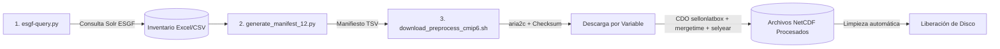

# Pipeline de Disponibilidad, Descarga y Preprocesamiento de Modelos CMIP6 (Centroamérica / DeepSD)

Este repositorio contiene las herramientas automatizadas para:
1. **Consultar la disponibilidad** de modelos climáticos globales CMIP6 en el índice distribuido de **ESGF MetaGrid** mediante la API Solr.
2. **Cruzar la disponibilidad** con el catálogo de modelos evaluados en **GCMEval**.
3. **Extraer URLs HTTPS directas** a nivel de archivo NetCDF (`type=File`), resolviendo réplicas y priorizando nodos de alta velocidad con soporte **Globus**.
4. **Ejecutar un pipeline automatizado de descarga y preprocesamiento con CDO**, diseñado con una **estrategia de optimización de espacio en disco** (descarga granular, recorte espacial, concatenación temporal y limpieza inmediata de temporales) con **capacidad de reanudación automática (Resume)**.

---

## 📋 Tabla de Contenidos

- [Estructura del Repositorio](#-estructura-del-repositorio)
- [Requisitos y Dependencias](#-requisitos-y-dependencias)
- [Modelos, Variables y Experimentos](#-modelos-variables-y-experimentos)
- [Flujo de Trabajo Paso a Paso](#-flujo-de-trabajo-paso-a-paso)
  - [Paso 1: Inventario Global y Extracción de URLs (`esgf-query.py`)](#paso-1-inventario-global-y-extracción-de-urls-esgf-querypy)
  - [Paso 2: Generación del Manifiesto de Ensamble (`generate_manifest_12.py`)](#paso-2-generación-del-manifiesto-de-ensamble-generate_manifest_12py)
  - [Paso 3: Descarga y Preprocesamiento CDO (`download_preprocess_cmip6.sh`)](#paso-3-descarga-y-preprocesamiento-cdo-download_preprocess_cmip6sh)
- [Estructura de Salida](#-estructura-de-salida)
- [Detalles Técnicos y Optimización](#-detalles-técnicos-y-optimización)
- [Autor](#-autor)

---

## 📂 Estructura del Repositorio

```text
.
├── esgf-query.py                  # Script principal: consulta ESGF Solr, genera inventario y extrae URLs
├── generate_manifest_12.py        # Generador del manifiesto específico para los 12 modelos de ensamble
├── download_preprocess_cmip6.sh   # Pipeline en Bash: descarga con aria2c + preprocesamiento con CDO
├── gcmeval_models.csv             # Catálogo de modelos compatibles con GCMEval
├── gcmeval_ensemble_models.csv    # Catálogo de miembros de ensamble GCMEval
│
├── cmip6_daily_inventory.xlsx     # Libro Excel (hojas: inventory, summary, selected, files)
├── cmip6_daily_inventory.csv      # Inventario tabular de datasets
├── cmip6_files.csv                # Catálogo completo de archivos NetCDF extraídos
│
├── cmip6_manifest_12_models.tsv   # Manifiesto TSV para automatización de los 12 modelos
├── cmip6_files_12_models.csv      # Catálogo CSV de los 12 modelos
├── cmip6_urls_12_models.txt       # Lista plana de URLs directas para descarga
└── README.md                      # Documentación del flujo de trabajo
```

---

## ⚙️ Requisitos y Dependencias

### 1. Entorno Python y Herramientas CLI (Recomendado vía Mamba / Conda)

Se recomienda utilizar **Mamba** (o **Conda**) por su rapidez en la resolución de paquetes de clima (`cdo`, `aria2`, `openpyxl`).

#### Opción A: Usando Mamba (Recomendado por velocidad)

```bash
# 1. Crear y activar el entorno con todas las dependencias en un solo paso
mamba create -n climate python=3.11 requests pandas openpyxl urllib3 cdo aria2 curl coreutils -c conda-forge -y
mamba activate climate
```

#### Opción B: Usando Conda

```bash
# 1. Crear y activar entorno
conda create -n climate python=3.11 -y
conda activate climate

# 2. Instalar paquetes de Python y herramientas CLI
conda install -c conda-forge requests pandas openpyxl urllib3 cdo aria2 curl coreutils -y
```

### 2. Herramientas del Sistema (CLI)

El pipeline automatizado de descarga y preprocesamiento utiliza:
- **`cdo`** (Climate Data Operators con soporte multi-hilo OpenMP)
- **`aria2c`** (Gestor de descargas aceleradas multiproceso y validación de hash)
- **`sha256sum`** o **`shasum`** (Verificación de integridad de archivos NetCDF)
- **`curl`**, **`awk`**, **`coreutils`**

Si trabajas directamente en sistemas Linux sin Conda/Mamba:

**En Ubuntu / Debian Linux:**
```bash
sudo apt-get update && sudo apt-get install -y cdo aria2 curl coreutils
```

**En RedHat / CentOS / Rocky Linux:**
```bash
sudo dnf install -y epel-release && sudo dnf install -y cdo aria2 curl coreutils
```

---

## 🌍 Modelos, Variables y Experimentos

### Modelos de Ensamble Seleccionados (12 Modelos)
1. `ACCESS-CM2` (`r1i1p1f1`)
2. `CESM2-WACCM` (`r1i1p1f1`)
3. `CNRM-CM6-1-HR` (`r1i1p1f2`)
4. `EC-Earth3` (`r4i1p1f1`)
5. `INM-CM4-8` (`r1i1p1f1`)
6. `IPSL-CM6A-LR` (`r2i1p1f1`)
7. `KACE-1-0-G` (`r1i1p1f1`)
8. `MPI-ESM1-2-LR` (`r5i1p1f1`)
9. `MRI-ESM2-0` (`r1i1p1f1`)
10. `NorESM2-MM` (`r1i1p1f1`)
11. `TaiESM1` (`r1i1p1f1`)
12. `UKESM1-0-LL` (`r1i1p1f2`)

### Variables Diarias (`table_id = day`)
- `ua`: Viento zonal (m/s)
- `va`: Viento meridional (m/s)
- `ta`: Temperatura del aire (K)
- `hur`: Humedad relativa (%)
- `hus`: Humedad específica (1)
- `zg`: Altura geopotencial (m)
- `psl`: Presión reducida a nivel del mar (Pa)

### Experimentos
- `historical` (Período de referencia: `1950-2014`)
- `ssp126`, `ssp245`, `ssp370`, `ssp585` (Período de proyección: `2015-2100`)

---

## 🚀 Flujo de Trabajo Paso a Paso



---

### Paso 1: Inventario Global y Extracción de URLs (`esgf-query.py`)

Este script realiza la búsqueda en el índice de MetaGrid (`https://metagrid.esgf-west.org/proxy/search`):
- **Fase 1**: Evalúa la disponibilidad a nivel de dataset para todas las variables y experimentos, consolida el resumen por realización y realiza el cruce con `gcmeval_models.csv`.
- **Fase 2**: Para las realizaciones seleccionadas, consulta a nivel de archivo (`type=File`), resuelve réplicas priorizando URLs Globus HTTPS y extrae los enlaces directos y hashes SHA256.

**Ejecución:**
```bash
python esgf-query.py
```

**Salidas generadas:**
- `cmip6_daily_inventory.xlsx`: Libro con 4 hojas:
  - `inventory`: Disponibilidad por experimento con formato condicional (verde/rojo).
  - `summary`: Resumen por modelo-realización ordenado por disponibilidad.
  - `selected`: Realizaciones completas con hipervínculos a MetaGrid y compatibilidad GCMEval.
  - `files`: Catálogo de archivos NetCDF con enlaces directos clicables "Abrir".
- `cmip6_daily_inventory.csv`: Inventario general plano.
- `cmip6_files.csv`: Catálogo plano de archivos NetCDF.

---

### Paso 2: Generación del Manifiesto de Ensamble (`generate_manifest_12.py`)

Genera el manifiesto optimizado para los 12 modelos requeridos para automatización con scripts de terminal.

**Ejecución:**
```bash
python generate_manifest_12.py
```

**Salidas generadas:**
- `cmip6_manifest_12_models.tsv`: Manifiesto delimitado por tabuladores (TSV) con URLs, checksums SHA256, tamaños y nombres de archivo.
- `cmip6_files_12_models.csv`: Catálogo CSV de los 12 modelos (7,901 archivos).
- `cmip6_urls_12_models.txt`: Lista plana de URLs directas.

---

### Paso 3: Descarga y Preprocesamiento CDO (`download_preprocess_cmip6.sh`)

El shell script ejecuta el pipeline de procesamiento aplicando una **estrategia de ciclo cerrado por variable** para optimizar el almacenamiento:

1. **Verificación de Reanudación (Resume)**: Comprueba si el archivo consolidado final ya existe y es un NetCDF válido; si es así, lo omite automáticamente.
2. **Descarga con `aria2c`**: Descarga únicamente los segmentos temporales de la variable actual en una carpeta temporal, validando el hash SHA256.
3. **Recorte espacial con CDO**: Aplica `sellonlatbox,-120,-40.5,-18.5,43` (dominio de Centroamérica) a cada chunk.
4. **Concatenación temporal (`mergetime`)**: Une los segmentos recortados en una única serie temporal.
5. **Selección de años (`selyear`)**:
   - Para `historical`: `1950/2014`
   - Para escenarios SSP: `2015/2100`
6. **Guardado y Limpieza**: Mueve el archivo final a `CMIP6_GCMs_Processed/<MODELO>/` y **elimina inmediatamente los archivos brutos y temporales**, liberando el espacio en disco antes de pasar a la siguiente variable.

**Ejecución estándar:**
```bash
# Dar permisos de ejecución
chmod +x download_preprocess_cmip6.sh

# Ejecutar pipeline
./download_preprocess_cmip6.sh
```

**Personalización de variables de entorno:**
```bash
# Especificar directorio de salida y cantidad de hilos CDO
OUTPUT_DIR="/mnt/disco_grande/CMIP6_Procesados" CDO_THREADS=16 ./download_preprocess_cmip6.sh

# Personalizar el cuadro de recorte (sellonlatbox)
LON_LEFT=-100 LON_RIGHT=-60 LAT_DOWN=0 LAT_UP=30 ./download_preprocess_cmip6.sh
```

---

## 🖥️ Ejecución en Servidores Remotos vía SSH (Segundo Plano)

Cuando se ejecuta el proceso en un servidor remoto a través de una sesión SSH, es fundamental evitar que el proceso se detenga si la conexión se cierra o se corta. Existen varias opciones recomendadas:

### Opción 1: Helper Automatizado `run_background.sh` (Más Sencillo)

El repositorio incluye el script auxiliar `run_background.sh` que gestiona automáticamente el proceso con `nohup` y archivos de log:

```bash
# Dar permisos de ejecución
chmod +x run_background.sh

# 1. Iniciar la descarga y procesamiento en segundo plano
./run_background.sh start

# 2. Ver el estado del proceso
./run_background.sh status

# 3. Monitorear los logs en tiempo real (Ctrl + C para salir sin detener el proceso)
./run_background.sh log

# 4. Detener el proceso si es necesario
./run_background.sh stop
```

---

### Opción 2: Usando `tmux` (Recomendado para Sesiones Interactivas)

`tmux` crea una sesión de terminal virtual persistente en el servidor que sobrevive a desconexiones de red:

```bash
# 1. Crear e ingresar a una nueva sesión de tmux
tmux new -s cmip6_download

# 2. Iniciar el script dentro de tmux
./download_preprocess_cmip6.sh

# 3. Desconectar la sesión sin detener el proceso (Detach):
#    Presiona: Ctrl + b, luego suelta y presiona d

# 4. (Opcional) Puedes cerrar tu sesión SSH con total seguridad.

# 5. Para volver a conectarte y ver el progreso en vivo:
tmux attach -t cmip6_download

# Para listar sesiones activas:
tmux ls
```

---

### Opción 3: Usando `screen`

Similar a `tmux`, `screen` mantiene la terminal viva:

```bash
# 1. Iniciar sesión screen
screen -S cmip6_download

# 2. Ejecutar pipeline
./download_preprocess_cmip6.sh

# 3. Desconectar: Presiona Ctrl + a, luego d

# 4. Reconectar más tarde:
screen -r cmip6_download
```

---

### Opción 4: Usando `nohup` Directo

```bash
# Lanzar proceso ignorando señales de desconexión (SIGHUP)
nohup ./download_preprocess_cmip6.sh > cmip6_pipeline.log 2>&1 &

# Ver el progreso en tiempo real
tail -f cmip6_pipeline.log

# Verificar el proceso en ejecución
ps aux | grep download_preprocess_cmip6
```

---

## 🪟 Ejecución en Windows con WSL2 (Sin que se corte al cerrar la ventana)

En **WSL2**, si cierras la ventana de Windows Terminal / Ubuntu, Windows envía una señal `SIGHUP` a los procesos interactivos y, además, puede suspender la máquina virtual de WSL2 si no detecta actividad activa.

Para evitar que el proceso se corte al cerrar la ventana en WSL2:

### 1. Método Recomendado: `tmux` + Mantener WSL2 Activo

1. **Instalar `tmux` en WSL2:**
   ```bash
   sudo apt-get install tmux -y
   # o con mamba:
   mamba install -c conda-forge tmux -y
   ```

2. **Iniciar una sesión de `tmux` dentro de WSL2:**
   ```bash
   tmux new -s cmip6_job
   ```

3. **Ejecutar el script:**
   ```bash
   ./download_preprocess_cmip6.sh
   ```

4. **Desconectar la sesión (`Detach`):**
   - Presiona: `Ctrl + b`, luego suelta y presiona `d`.

5. **Para volver a ver el progreso en cualquier momento:**
   Abre una nueva ventana de WSL2 y escribe:
   ```bash
   tmux attach -t cmip6_job
   ```

---

### 2. Configurar WSL2 para que no se apague al cerrar ventanas (Windows 11)

Si utilizas **Windows 11**, puedes habilitar `systemd` en WSL2 para que mantenga todos los procesos en segundo plano activos de forma permanente:

1. Edita o crea el archivo `/etc/wsl.conf` dentro de WSL2:
   ```bash
   sudo nano /etc/wsl.conf
   ```

2. Agrega las siguientes líneas:
   ```ini
   [boot]
   systemd=true
   ```

3. Reinicia WSL2 desde PowerShell de Windows:
   ```powershell
   wsl --shutdown
   ```

A partir de ese momento, cualquier proceso iniciado con `tmux` o `./run_background.sh start` continuará ejecutándose en segundo plano en Windows, incluso si cierras todas las ventanas de terminal.

---

### 3. Lanzar el proceso en segundo plano directamente desde Windows (PowerShell / CMD)

También puedes lanzar el proceso en segundo plano desde PowerShell de Windows sin mantener ninguna ventana de WSL abierta:

```powershell
# Iniciar en segundo plano sin bloquear la terminal de Windows:
wsl -d Ubuntu --exec bash -c "cd /ruta/de/tu/proyecto && ./run_background.sh start"

# Consultar el estado en cualquier momento:
wsl -d Ubuntu --exec bash -c "cd /ruta/de/tu/proyecto && ./run_background.sh status"
```

---

## 📁 Estructura de Salida

Los archivos NetCDF finales se organizan en carpetas individuales por modelo:

```text
CMIP6_GCMs_Processed/
├── ACCESS-CM2/
│   ├── hur_day_ACCESS-CM2_historical_r1i1p1f1_19500101-20141231.nc
│   ├── hur_day_ACCESS-CM2_ssp126_r1i1p1f1_20150101-21001231.nc
│   ├── psl_day_ACCESS-CM2_historical_r1i1p1f1_19500101-20141231.nc
│   ├── ta_day_ACCESS-CM2_historical_r1i1p1f1_19500101-20141231.nc
│   ├── ua_day_ACCESS-CM2_historical_r1i1p1f1_19500101-20141231.nc
│   ├── va_day_ACCESS-CM2_historical_r1i1p1f1_19500101-20141231.nc
│   └── zg_day_ACCESS-CM2_historical_r1i1p1f1_19500101-20141231.nc
├── CESM2-WACCM/
├── CNRM-CM6-1-HR/
├── EC-Earth3/
├── INM-CM4-8/
├── IPSL-CM6A-LR/
├── KACE-1-0-G/
├── MPI-ESM1-2-LR/
├── MRI-ESM2-0/
├── NorESM2-MM/
├── TaiESM1/
└── UKESM1-0-LL/
```

---

## 💡 Detalles Técnicos y Optimización

### 1. Nodos Globus y URLs HTTPS
En ESGF, los nodos integrados con la infraestructura de Globus (como **Argonne ALCF** `eagle.alcf.anl.gov` y **LLNL**) exponen el servicio `HTTPServer` a través de URLs directas en el dominio `https://*.data.globus.org/`. El script prioriza automáticamente estas URLs por ofrecer altas tasas de transferencia y disponibilidad directa vía HTTPS estándar (código HTTP 200).

### 2. Deduplicación Inteligente de Réplicas
Cuando un archivo existe replicado en varios nodos (`data_node`), el algoritmo clasifica y selecciona la mejor réplica:
1. **Prioridad 1 (Máxima)**: URLs HTTPS de Globus (`*.data.globus.org` o nodos con soporte Globus).
2. **Prioridad 2**: URLs HTTPS seguras de THREDDS (`https://.../thredds/fileServer/...`).
3. **Prioridad 3**: URLs HTTP estándar de THREDDS (`http://.../thredds/fileServer/...`).

### 3. Idempotencia y Reanudación (Resume)
Si el proceso se detiene por cortes de red o reinicio del sistema:
- El script verifica la validez estructural del archivo NetCDF destino (`cdo -s sinfo`).
- Si el archivo está completo, lo reporta como `[OMITIDO]` y continúa con el siguiente bloque, evitando descargas redundantes.

---

## 👤 Autor

- **Will Abarca** (`wabarca@ambiente.gob.sv`)
- Ministerio de Medio Ambiente y Recursos Naturales (MARN), El Salvador.
